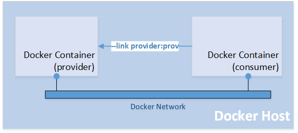
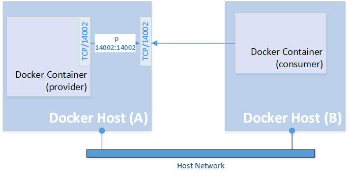

# Deploy and Run Elektron SDK in Docker
## Introduction
Docker is an open containerization platform for developing, testing, deploying, and running any software applications. In Docker, the applications are presented as lightweight, portable, and self-sustaining containers which can be simultaneously run in a loosely isolated and virtual environment on a given host. Containers are lightweight because they don’t use the extra load of a hypervision, but they run directly within the host machine’s kernel. This means more containers can be run concurrently on a given host comparing to other virtual machine's technologies. 

Developers can use Docker to automate the repetitive chores, such as setting up and configuring controlled development environments. Each environment or container has its own resources that are independent from other containers.  Numerous containers of separate applications are running completely on different stacks. Therefore, developers can avoid common problems, such as run-time library conflictions, and unsupported environments and focus totally on developing software. Moreover, they can simply delete the containers without any footprints left on the host machine.

This article demonstrates a way to deploy and run Elektron SDK's applications in the Docker platform. It starts with building a Docker image for Elektron SDK and then shows usages of this image including running the provider and consumer examples.

However, the Elektron SDK isn't qualified on the Docker platform. If you find any problems while running it on the Docker platform, the issues must be replicated on bare metal machines before contacting the helpdesk support.

## Docker Installation
Docker is available on many platforms including Windows, Mac, CentOS, Debian, Oracle Linux, RHEL, and Ubuntu. In this article, Oracle Linux Server 6 and Docker 1.12.6 are used. Please follow the following steps to install a Docker on Oracle Linux Server 6.

1. Installing Docker engine

> The Docker Engine is a lightweight and powerful client-server application used to build, manage, and containerize the applications. It is built on top of the Linux kernel with extensively leveraging its features. It can be installed by using the corresponding packaging tool of the Linux distribution, such as using the **apt-get** command for Debian and Ubuntu, and the **yum** command for RedHat, Fedora, and CentOS.


```
$ sudo yum install docker-engine
```

2. Starting and activating the Docker service

> After installing the Docker, its service must be started and activated on restart by using the following commands.

```
$ sudo service docker start
$ sudo chkconfig docker on
```
3. Verifying the Docker service

> After starting the Docker service, the following commands can be used to verify the version and status of the Docker service.

```
$ sudo docker info
...
Server Version: 1.12.6
...
$ sudo service docker status
docker (pid  1290) is running...

```

The running status indicates that the Docker service is ready to be used. The next section briefly explains a Docker image and container.

## Docker Image and Container

A Docker image is a lightweight, stand-alone, executable package that includes everything for running an application including the code, runtime libraries, environment variables, and configuration files. There are a lot of public Docker images registered in [the Docker registry](https://hub.docker.com). The registry is for registering the Docker images, whereas the repository is for storing those registered Docker images. The following command pulls an Ubuntu Docker image from the Docker repository.

```
$ sudo docker pull ubuntu
```
You can list the available Docker image in the host machine by using the following command.

```
$ sudo docker images
REPOSITORY          TAG                 IMAGE ID            CREATED           
ubuntu              latest              2d696327ab2e        2 weeks ago         121.6 MB

```

A Docker image can be run inside a container. The following command creates a new running instance of **ubuntu** Docker image and prints **Hello World** by using the **echo** command. 

```
$ sudo docker run --rm ubuntu echo "Hello World"
```
|Option|Description|
|----------|-----------|
|--rm |  Automatically remove the container when it exits|

If **--rm** isn't used, **docker rm** command can be used to remove the container.

At this point, you have already known the basic concepts of Docker image and container. The next section explains how to build a new Docker image for Elektron SDK. 

## Elektron SDK Docker Image

Docker allows users to build a new Docker image from an existing Docker image by using the Dockerfile. Dockerfile is a text-based script that contains special commands in a sequence for building the new images from the existing base images. The commands include selecting a base image from the Docker repository, adding metatdata, installing all the required applications, compiling the applications, and setting up environment variables, and making the necessary file changes.

The list of instructions in the Dockerfile for building an Elektron SDK Docker image is:

1. Set a base image for a build process to Oracle Linux 7

```
FROM oraclelinux:7
```
> The **FROM** instruction is the first valid instruction of a Dockerfile. It sets a base image for a build process. Subsequent instructions would build on top of this base image. Elektron SDK supports Oracle Linux 7 so it is used as a base image for building an Elektron SDK Docker image.

2. Set author's detail of the image

```
LABEL maintainer="Thomson Reuters Active Help Service"
```
> The **LABEL** instruction adds key-value pair metadata to an image. The above instruction adds a metadata for a maintainer of this image. Users can use **docker inspect** command to view an image's labels.

3. Load and build Elektron SDK libraries

> In this step, the **RUN** instruction is used to load all required packages, and build Elektron SDK libraries and examples. It accepts multiple commands separated by a && operator. The backslash is also used to split long RUN statements into multiple lines. 

> First, it runs the **yum** command to install gcc, ksh, and lsb packages. These packages are required to build Elektron SDK libraries.  

```
RUN yum -y install gcc-c++.x86_64 git.x86_64 ksh redhat-lsb-core.x86_64 \
```
> Then, it creates a directory (/opt/thomsonreuters) for installing Elektron SDK and uses **git** command to clone the Elektron SDK package from github.

```
... 
  && mkdir -p /opt/thomsonreuters \
  && cd /opt/thomsonreuters \
  && git clone --recursive https://github.com/thomsonreuters/Elektron-SDK.git \
...
```
> Next, it follows steps in [the github page](https://github.com/thomsonreuters/Elektron-SDK/tree/master/Cpp-C) to build Elektron SDK - C/C++ edition.

```
  && cd Elektron-SDK/Elektron-SDK-BinaryPack/Cpp-C/Eta \
  && ./LinuxSoLink \
  && cd /opt/thomsonreuters/Elektron-SDK/Cpp-C/Eta/Impl \
  && make all \
  && cd ../Utils/Libxml2 \
  && make \
  && cd /opt/thomsonreuters/Elektron-SDK/Cpp-C/Ema/Src/Access \
  && make \
```
>> Finally, it compiles provider and consumer examples in the Elektron SDK C package and creates softlinks to compiled binaries and data dictionary files.

```
...
  && cd /opt/thomsonreuters/Elektron-SDK/Cpp-C/Eta/Applications/Examples/Consumer \
  && make \
  && cd .. \
  && ln -s Consumer/*/*/Consumer consumer \
  && cd Provider \
  && make \
  && cd .. \
  && ln -s Provider/*/*/Provider provider \
  && ln -s ../../etc/RDMFieldDictionary RDMFieldDictionary \
  && ln -s ../../etc/enumtype.def enumtype.def
...
```
4. Set a working directory 

```
WORKDIR /opt/thomsonreuters/Elektron-SDK/Cpp-C/Eta/Applications/Examples
```
> The above **WORKDIR** instruction sets a working directory to the **Examples** directory of Elektron SDK C package. This directory contains softlinks to provider and consumer applications which can be executed in Docker containers.

5.  Set a default command for an executing container
```
CMD /bin/sh
```
> The **CMD** instruction specifies a default command which will be executed when a container is launched from a Docker image. However, it can be overridden by the **docker run** subcommand arguments. The default command executed when launching this image is shell command. 

The full Dockerfile is available in [github](https://github.com/TR-API-Samples/Article.EMA.ETA.Docker). 

To build a Docker image from this Dockerfile, you can copy this Docker file to a host machine, and then run the following command in the same directory that contains this Dockerfile.

```
$ ls -al
...
-rw-rw-r--. 1 user1 user1 1004 Oct  9 04:27 Dockerfile
...
$ sudo docker build -t elektron-sdk .
```
|Option|Description|
|----------|-----------|
|-t |  Specify the optional tag name for the image | 

It will take some times to build the Elektron SDK image. The built image will be tagged or named with **elektron-sdk**.

Otherwise, Docker can build an image directly from the Dockerfile in github by using the following command:

```
$ sudo docker build -t elektron-sdk https://github.com/TR-API-Samples/Article.EMA.ETA.Docker.git
```
To do this, please make sure that **git** package is installed on the host machine.

After building, the **docker images** command can be used to list all available Docker images on the host machine.

```
$ sudo docker images
REPOSITORY          TAG                 IMAGE ID            CREATED             SIZE
elektron-sdk        latest              2155a4084df2        14 seconds ago      2.142 GB
...
```
Now, the Elektron SDK Docker image is ready to be used. The next section shows how to use and run this image in various scenarios.

## Usages

### 1. Run Provider and Consumer on the same Docker host

The Provider and Consumer examples are built in the image and ready to run in Docker containers. This section shows how to run the provider and consumer examples in Docker containers on the same Docker host.



To run these examples, the example name must be specified as an argument of the **docker run** command in order to override the default shell command.

The following command launches a Docker container with the elektron-sdk image and runs the provider example in the container. The example's arguments can also be defined after the application's name.

```
$ sudo docker run --name provider -t elektron-sdk ./provider -p 14002 -s DIRET_FEED -runtime 300
```
|Option|Description|
|----------|-----------|
|--name | Assign a name to the container |
|-t |  Allocate a pseudo-TTY for this container | 
 
 This command sets a name of the container to "provider" by using the --name option so it can be used by other Docker commands. It also uses the -t option to attach a terminal to the container in order to see the output when running the provider example.

After running the command, you will see the output of the provider example on the screen.

```
$ sudo docker run --name provider -t elektron-sdk ./provider -p 14002 -s DIRECT_FEED
portNo: 14002
serviceName: DIRECT_FEED
serviceId: 1

Server IPC descriptor = 3 bound on port 14002

```
Press Ctrl+c to detach the terminal. 

Next, launch another Docker container with the consumer example to consume the data from the provider container.
```
$ sudo docker run --name consumer -t --link provider:prov1 elektron-sdk ./consumer -h prov1 -p 14002 -s DIRECT_FEED -mp TEST

```
|Option|Description|
|----------|-----------|
|--name | Assign a name to the container |
|-t |  Allocate a pseudo-TTY for this container | 
|--link | Add link to another container |

This command sets a name of the container to "consumer". It uses the --link option to link this container to the container named "provider" and set an alias to "prov1". After linking, the application in the container can use this alias to create a network connection to the linked Docker container.

After running the command, you will see the output of the consumer example on the screen.

```
$ sudo docker run --name consumer -t --link provider:prov1 elektron-sdk ./consumer -h prov1 -p 14002 -s DIRECT_FEED -mp TEST
Proxy host:
Proxy port:

Input arguments...

Using Connection Type = 0
srvrHostname: prov1
srvrPortNo: 14002
serviceName: DIRECT_FEED

Attempting to connect to server prov1:14002...

Attempting to connect to server prov1:14002...

Channel IPC descriptor = 3

Channel 3 In Progress...

Channel 3 Is Active
Connected to eta3.1.1.L1.linux.rrg 64-bit Static device.
Ping Timeout = 60

Received Login Response for Username: root
        State: Open/Ok/None - text: "Login accepted by host 38ec020e0900"


Received Source Directory Response
        State: Open/Ok/None - text: "Source Directory Refresh Completed"

Received serviceName: DIRECT_FEED


TEST
DOMAIN: RSSL_DMT_MARKET_PRICE
State: Open/Ok/None - text: "Item Refresh Completed"
        RDNDISPLAY          100
        RDN_EXCHID          SES(155)
        DIVPAYDATE          22 OCT 2010
        TRDPRC_1            1.00
        BID                 0.99
        ASK                 1.03
        ACVOL_1             100000.00
        NETCHNG_1           2.15
        ASK_TIME            09:34:00:000:000:000

```
Press Ctrl+c to detach the terminal. 

After detaching the terminal, the containers are still running in background. The following Docker commands can be used with the container names to manage the containers.

|Docker Command|Description|
|----------|-----------|
|docker ps -a | List all containers |
|docker start CONTAINER [CONTAINER...] | Start one more more stopped containers  |
|docker stop CONTAINER [CONTAINER...] |  Stop one or more running containers | 
|docker rm CONTAINER [CONTAINER...] |Remove one or more containers |


In summary, to run provider and consumer containers on the same Docker host, the --link option is used to create a link between containers.

### 2. Run Provider and Consumer on different Docket hosts

The provider and consumer containers can be run on different Docker hosts. The elektron-sdk Docker image must be built on both Docker hosts. In this scenario, the provider container is on host A and the consumer container is on host B.



Use the following command to launch the provider container on host A.

```
$ sudo docker run -t --name providerA -p 14002:14002 elektron-sdk ./provider -s DIRECT_FEED -p 14002

portNo: 14002
serviceName: DIRECT_FEED
serviceId: 1

Server IPC descriptor = 3 bound on port 14002

```
|Option|Description|
|----------|-----------|
|--name | Assign a name to the container |
|-t |  Allocate a pseudo-TTY for this container | 
|-p | Publish a container's port(s) to the host |

 It sets a name of the container to "providerA" by using the --name option. It uses the -t option to attach the terminal in order to see the output when running the provider example and uses the -p option to publish the TCP 14002 port used by the container to TCP 14002 port on the host machine. Therefore, the consumer container can connect to this port on the host machine to consumer the data from the container.

 Then, use the following command to launch the consumer container on host B.

 ```
 $ sudo docker run -t --name consumerB elektron-sdk ./consumer -h <host_A_IP> -p 14002 -s DIRECT_FEED -mp TEST
 ```
 You need to change <host_A_IP> to the IP address of host A machine. This command launches a container from the elektron-sdk image. The container will run consumer example which connects to TCP 14002 port on host A and consume data from DIRECT_FEED service. 

 In summary, to run provider and consumer examples on different Docker hosts, the -p option must be used when running the provider container to publish the listening TCP port used by the provider to the host machine. Then, the consumer container can connect to that published port on that host machine. 


### 3. Access shell command to developer application or build examples

If a Docker container is launched from the **elektron-sdk** image without any arguments, the default command (/bin/sh) will be executed.

```
$ sudo docker run -it --name esdk elektron-sdk
```

|Option|Description|
|----------|-----------|
|-i | Keep the standard input open for this container |
|-t | Allocate a pseudo-TTY for this container |
|--name | Assign a name to the container |

After running this command, you can access shell in the container. Then, you can use the container to build Elektron SDK applications, or modify and build other examples. The Elektron SDK is in /opt/thomsonreuters/Elektron-SDK/ directory.

## Conclusion
Docker is an open containerization platform for developing, testing, deploying, and running any software applications. This article shows how to deploy and run Elektron SDK's applications in the Docker platform. It starts with building a Docker image for Elektron SDK and then showing some use cases including running the provider and consumer examples. 
## References
1. [Docker Documentation](https://docs.docker.com/)
2. [Chelladhurai, J., Raj, P. and Singh, V. (2015). Learning Docker](https://www.packtpub.com/virtualization-and-cloud/learning-docker)
3. [TOP 10 BENEFITS YOU WILL GET BY USING DOCKER](https://apiumhub.com/tech-blog-barcelona/top-benefits-using-docker/)
4. [Installing and Configuring the Docker Engine on Oracle Linux 6](https://docs.oracle.com/cd/E37670_01/E75728/html/section_kfy_f2z_fp.html)
